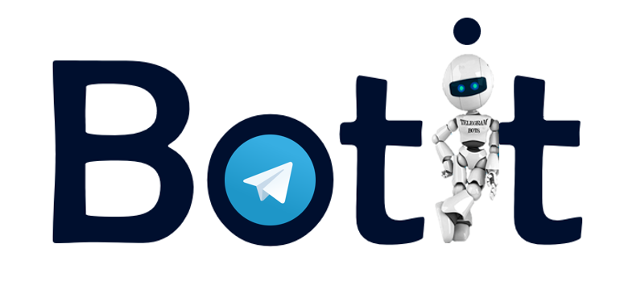

# Build your first bot with `Botit API 🤖`

## Why choose Bot it?

Many organizations need systems that will help manage logistics and various processes so that the use of automation can streamline work.

These needs require sharing between members of the organization, use and retention of data, surveys, scheduling meetings and more.
The ability to develop technological tools that will meet those needs requires extensive and complex programming knowledge.

**With bot it API you will get the same results and even better**

### `Faster & Easier & Friendlier`

## What in our API?

In the API you will meet a lot of tools that will help you build your bot in the easiest way
tools like: read and write to sheets, sharing data with users using Database, create scheduling messages, manage groups and more

## So how do I get started? 
1. First you will need to install all the framework (that includes the API and tools) [start here](https://github.com/dvirby/BotIt/wiki/Getting-started)
2. Then create first feature to learn how to write feature [first feature](https://github.com/dvirby/BotIt/wiki/Create-your-first-feature)
3. Now you can read the rest of the wiki to understand how to create features you want
4. **The best way to write feature is by looking in existing features **

## Feature for examples
We provide with the framework features for example and for some of them there is explantion in the wiki
Use them to learn about the API and other tools !
Each feature conatin another ability to help you learn about them

## Some example features that attached:
### * Libary manager 📚
### * Reminder ⏰
### * System to manage washing machines 🧺
### * Surveys ✔️
### * Manage Groups 👥

`In a quick look you can see how easy and simple it to write bot with bery strong abilites`

## What is the difference between python-telegram ibrary and botIt framework?

In fact BotIt uses the python-Telegram library and makes it easier to create bots and features with API that wraps the python-Telegram library and make a lot of functions and operations easy-to-use.
In addition there are abilities and tools that BotIt already provides like using Database, group management, performing services for some users, sharing information between users and more and more

**In fact with BotIt everything is ready and you only need to write the logic of the features you want to create 
A feature can include several lines of code!
**
